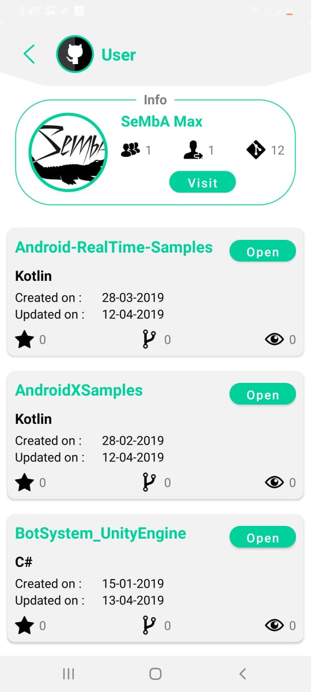

# github-resume

It&#39;s a simple github resume viewer which displays github profiles via operating Github REST API V3.

## Demo

  
  

## Tech Stack
- **Kotlin**
- **MVVM**
- **Dagger**
- **Retrofit**
- **RxJava**
- **JUnit5**
- **Mockito**
- **Navigation Component**
